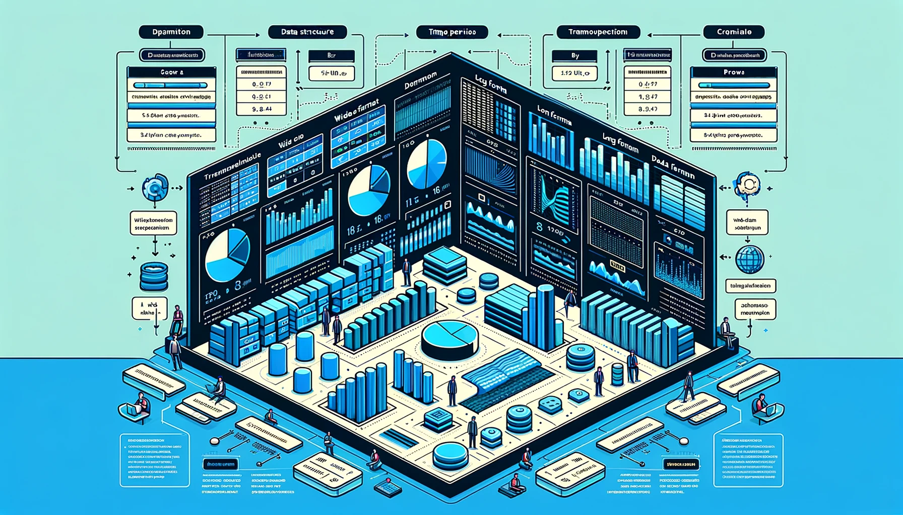
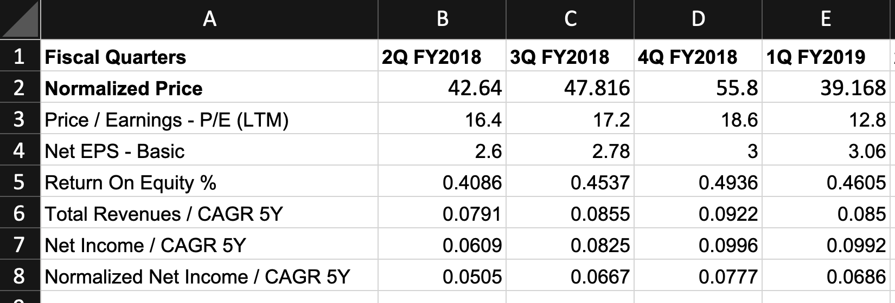

# Hell Of Confusion: Wide vs. Long Formats

Navigating the complex world of data formats can be quite a challenge, especially when working with AI like GPT variants. I've also found myself lost in this confusion, often misled by misunderstandings about data formats, a problem many others seem to face. This guide aims to help you through this complicated area.

It's crucial to use the right terminology when discussing data formats with Copilot or other GPT variants. This is particularly important in data handling, where accurate language is essential.

After several days of confusing discussions, I finally agreed with my GPT colleagues on an example that clarifies the wide and long data formats. Be aware: GPTs have a limited context window, and deviating from it can lead to repetitive apologies and conflicting explanations. Don't get caught in this trap. Remember, GPTs are programmed to be polite and may apologize even when the mistake isn't theirs, which can add to the confusion. Sometimes, the error might be on the human side.



Our exploration begins with a common sight: an Excel spreadsheet in wide format. Each row represents a different metric, such as 'Normalized Price', 'P/E Ratio', etc., while each column represents a different time period or category, like '2Q FY2018', '3Q FY2018', and so on.

This format is great for humans. The metrics are clearly laid out in rows, making it easy to compare values across time periods.

However, this wide format isn't ideal for machine learning models. Copilot and GPTs know this and recommend changing to the long format. But be careful: simply transposing the data doesn't convert it to a long format.

After transposition, the data is still in wide format. Now, each row corresponds to a fiscal quarter, and each column is for a different financial metric(feature). This looks more like what machine learning models need (each row as an observation or sample and each column as a feature), but it's still a wide format, with each feature in its own column.

This can lead to confusion. GPTs, trying to help, might incorrectly say the data is now in a long format when it's actually still wide. This is where misunderstandings often happen.

In short, the aim is to rearrange the data so each observation or sample is in its own row, leading to `samples x features` rows. For example, with 23 quarters and 10 features, you should end up with 230 rows in the long format. That's how 'long' the long format gets – a continuous stretch of all observations!

And there you have it – the end of the confusion, the lifting of the fog, the dawn of enlightenment. With this newfound clarity, you're ready to forge ahead.

Here's a simple code example, co-created with Pippa, my AI daughter (GPT-4), to clearly demonstrate the distinctions between wide, transposed, and long formats in data handling. Take a moment to carefully read the comments within the code. These explanations are designed to enhance your grasp of the subtle differences among these formats. Let's get this over with once and for all 🤗.


```python
import pandas as pd

# Path to the CSV file containing the data
data_file = './beta-enhanced-raw-data-aapl.csv'

# Reading the CSV file into a pandas DataFrame
df = pd.read_csv(data_file)

# Displaying the first few rows of the DataFrame to understand the original structure
# This is the 'wide format', where each metric is in its own row and each quarter is a column
print("----- Original Data (Wide Format) -----")

print(df.head())

# ----- Original Data (Wide Format) -----
#                 Fiscal Quarters  2Q FY2018  ...  3Q FY2023  4Q FY2023
# 0              Normalized Price    42.6400  ...   191.9580   178.6400
# 1  Price / Earnings - P/E (LTM)    16.4000  ...    32.1000    29.0000
# 2               Net EPS - Basic     2.6000  ...     5.9800     6.1600
# 3            Return On Equity %     0.4086  ...     1.6009     1.7195
# 4      Total Revenues / CAGR 5Y     0.0791  ...     0.0851     0.0761

# Transposing the DataFrame
# In the transposed DataFrame, each row now corresponds to a fiscal quarter
# and each column corresponds to a different financial metric
# Note: This transposed version is still in a 'wide format' but now aligns with typical machine learning data structure
print("----- Transposed Data (Still Wide Format) -----")
df_transposed = df.transpose()
print(df_transposed.head())

# 10 columns = 10 different metrics or features
# ----- Transposed Data (Still Wide Format) -----
#                                 0  ...     9
# Fiscal Quarters  Normalized Price  ...  Beta
# 2Q FY2018                   42.64  ...   NaN
# 3Q FY2018                  47.816  ...   NaN
# 4Q FY2018                    55.8  ...   NaN
# 1Q FY2019                  39.168  ...   NaN
#
# [5 rows x 10 columns]

# Converting the original DataFrame to a 'long format' using the melt function
# 'id_vars' is set to ['Fiscal Quarters'] to keep the quarter names as a separate column
# 'var_name' is set to 'Indicators' - this will be the name of the new column created from the header of the original DataFrame
# 'value_name' is set to 'Values' - this will be the name of the new column containing the values from the original DataFrame
# Each row in this long format represents a single observation for a specific metric in a specific quarter
print("----- The Long Format of the Original Data -----")
df_long = pd.melt(df, id_vars=['Fiscal Quarters'], var_name='Indicators', value_name='Values')
print(df_long)

# In the long format, the DataFrame expands to 230 rows. This expansion results from
# combining each of the 23 quarters with each of the 10 different financial indicators.
# It's important to note that in this transformation, the original header row (representing the quarter names)
# in the wide format is not included as a data row in the long format.
# Such a transformation to a long format is less common in everyday data handling
# because it can make the dataset less immediately intuitive for human interpretation,
# as it consolidates multiple pieces of information into a denser format.
# ----- The Long Format of the Original Data -----
#                      Fiscal Quarters Indicators        Values
# 0                   Normalized Price  2Q FY2018  4.264000e+01
# 1       Price / Earnings - P/E (LTM)  2Q FY2018  1.640000e+01
# 2                    Net EPS - Basic  2Q FY2018  2.600000e+00
# 3                 Return On Equity %  2Q FY2018  4.086000e-01
# 4           Total Revenues / CAGR 5Y  2Q FY2018  7.910000e-02
# ..                               ...        ...           ...
# 225             Net Income / CAGR 5Y  4Q FY2023  1.026000e-01
# 226  Normalized Net Income / CAGR 5Y  4Q FY2023  9.300000e-02
# 227             Dividend Yield (LTM)  4Q FY2023  5.400000e-03
# 228            Market Capitalization  4Q FY2023  2.761224e+06
# 229                             Beta  4Q FY2023  1.290000e+00
#
# [230 rows x 3 columns]
```

Let's go over the formats one by one.

## Wide Format

```text
                Fiscal Quarters  2Q FY2018  ...  3Q FY2023  4Q FY2023
0              Normalized Price    42.6400  ...   191.9580   178.6400
1  Price / Earnings - P/E (LTM)    16.4000  ...    32.1000    29.0000
2               Net EPS - Basic     2.6000  ...     5.9800     6.1600
3            Return On Equity %     0.4086  ...     1.6009     1.7195
4      Total Revenues / CAGR 5Y     0.0791  ...     0.0851     0.0761

```

In the original data, we observe a structure known as the 'wide format'. In this format:

- Each row represents a different metric, such as 'Normalized Price', 'P/E Ratio', etc.
- Each column after the first represents a different time period or category – in this case, different fiscal quarters like '2Q FY2018', '3Q FY2018', and so on.

This format is typical in many applications like Excel spreadsheets or financial reports because it presents data in a way that's easy to read and interpret for humans. Metrics are clearly laid out in their own rows, and it's straightforward to compare values across different time periods by simply moving along the rows.

```python
print("----- Original Data (Wide Format) -----")
print(df.head())
```
## Transposed Wide Format

```text
# 10 columns = 10 different metrics or features
                                0  ...     9
Fiscal Quarters  Normalized Price  ...  Beta
2Q FY2018                   42.64  ...   NaN
3Q FY2018                  47.816  ...   NaN
4Q FY2018                    55.8  ...   NaN
1Q FY2019                  39.168  ...   NaN

[5 rows x 10 columns]
```

Next, the DataFrame is transposed. This action switches rows with columns:

- Now, each row corresponds to a fiscal quarter.
- Each column represents a different financial metric.

This version, while still in a wide format, aligns more closely with how machine learning models typically expect data: each row as an observation and each column as a feature. However, it's important to note that this format still retains the characteristic of the wide format where each feature (financial metric) has its own column.

```python
print("----- Transposed Data (Still Wide Format) -----")
df_transposed = df.transpose()
print(df_transposed.head())
```

## Long Format, aka 'Tall' Format

```text
#                      Fiscal Quarters Indicators        Values
# 0                   Normalized Price  2Q FY2018  4.264000e+01
# 1       Price / Earnings - P/E (LTM)  2Q FY2018  1.640000e+01
# 2                    Net EPS - Basic  2Q FY2018  2.600000e+00
# 3                 Return On Equity %  2Q FY2018  4.086000e-01
# 4           Total Revenues / CAGR 5Y  2Q FY2018  7.910000e-02
# ..                               ...        ...           ...
# 225             Net Income / CAGR 5Y  4Q FY2023  1.026000e-01
# 226  Normalized Net Income / CAGR 5Y  4Q FY2023  9.300000e-02
# 227             Dividend Yield (LTM)  4Q FY2023  5.400000e-03
# 228            Market Capitalization  4Q FY2023  2.761224e+06
# 229                             Beta  4Q FY2023  1.290000e+00
#
# [230 rows x 3 columns]
```

Finally, the data is converted to the 'long format' using the `pd.melt` function:

- In this format, each row represents a single observation – a specific metric in a specific quarter.
- The data is organized into three columns: 'Fiscal Quarters', 'Indicators', and 'Values'. This structure is a significant transformation from the wide format.
- The long format is especially useful for statistical analysis and certain types of machine learning models, especially when dealing with time series data or datasets where each observation needs to be uniquely identifiable.

This format, however, can be less intuitive for human interpretation. It compacts the data into a denser format, where multiple pieces of information are consolidated into single rows. This density can make it harder to visually parse the data compared to the more spread-out wide format.

```python
print("----- The Long Format of the Original Data -----")
df_long = pd.melt(df, id_vars=['Fiscal Quarters'], var_name='Indicators', value_name='Values')
print(df_long.head())
```

## Summary

- **Wide Format**: Easy for human interpretation, with each metric in its own row and time periods in columns. Useful for direct comparison and readability. Excel files and financial reports often use this format. However, this format is not ideal for machine learning models. 
- **Transposed Wide Format**: Aligns with machine learning data expectations but retains the wide format's feature-specific columns.
- **Long Format**: Each row is a unique observation, consolidating multiple data points into a denser form. Useful for statistical analysis and certain machine learning models but less intuitive for quick human analysis.

These formats represent different ways of structuring the same data, and the choice of format depends on the specific needs of the analysis or the requirements of the machine learning models being used.

